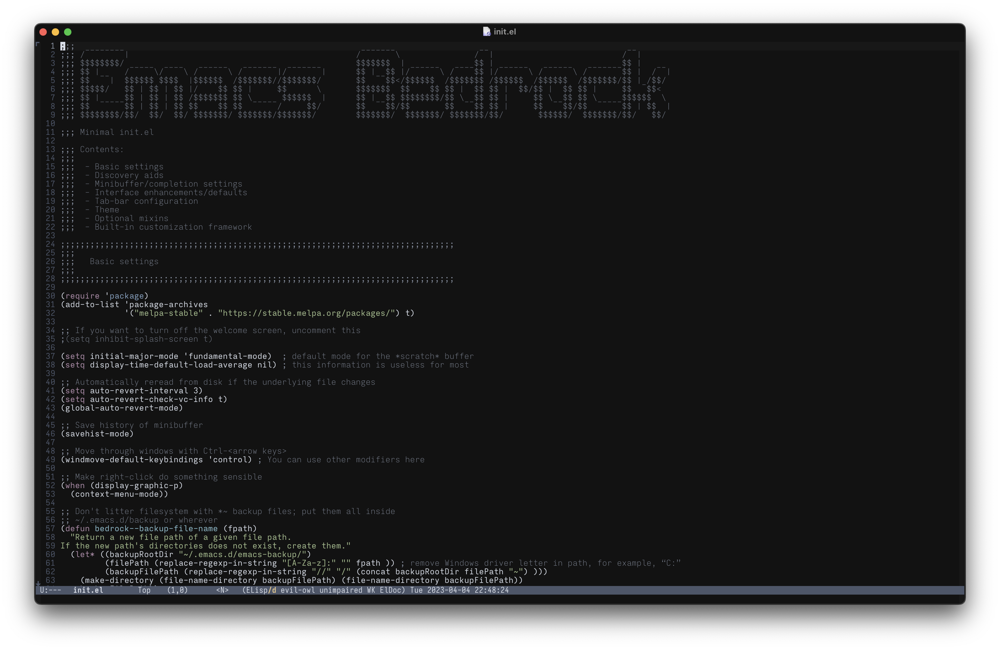
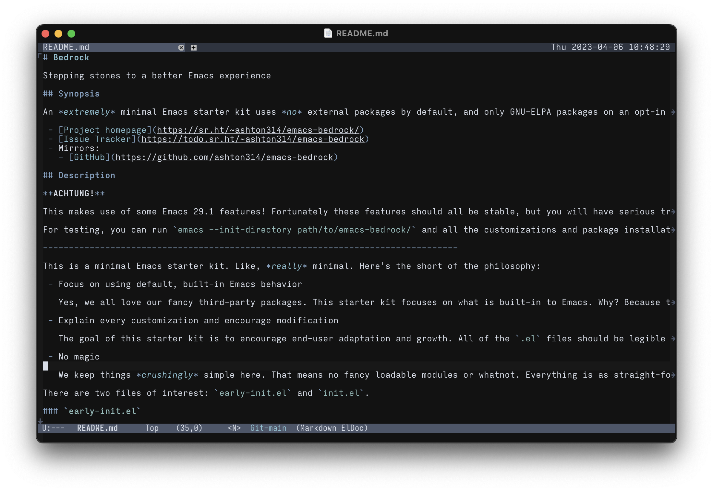
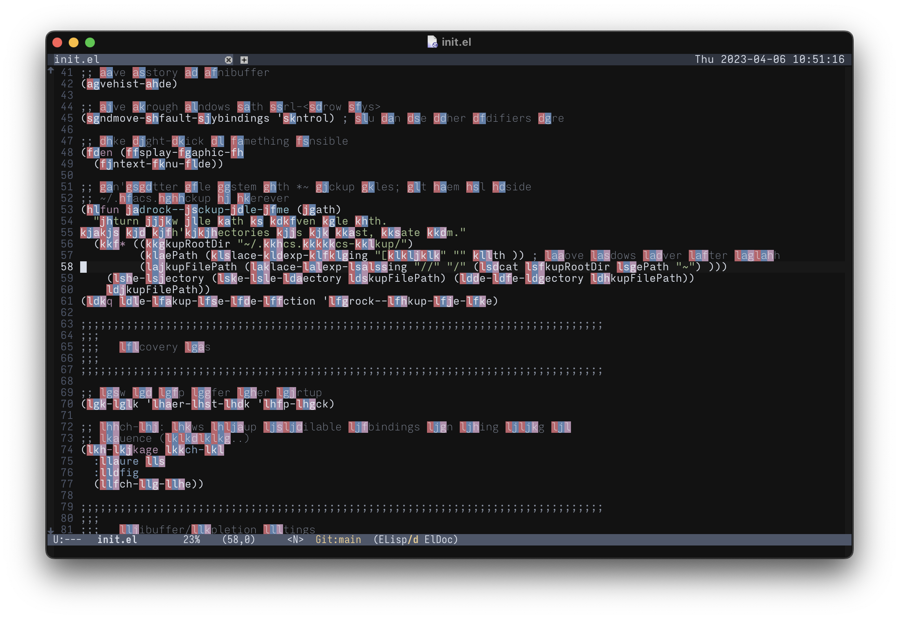
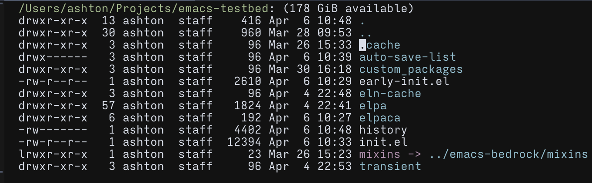
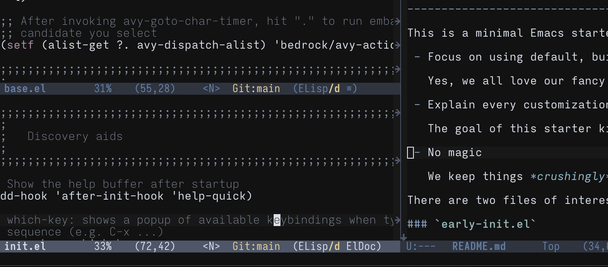
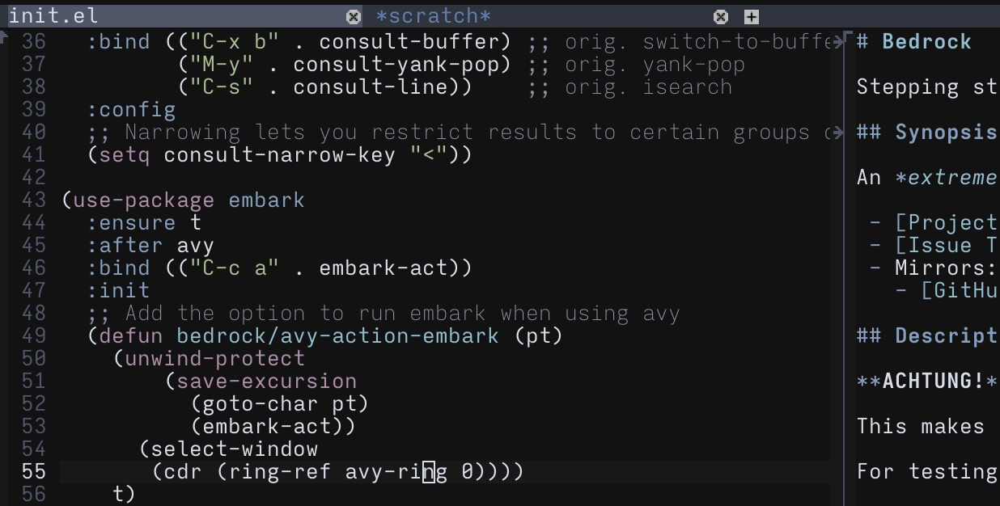
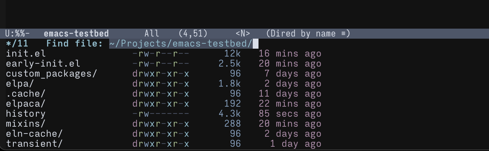
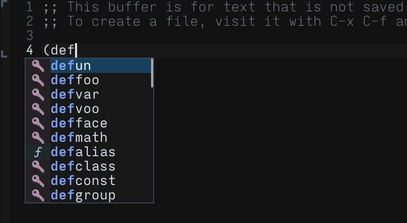
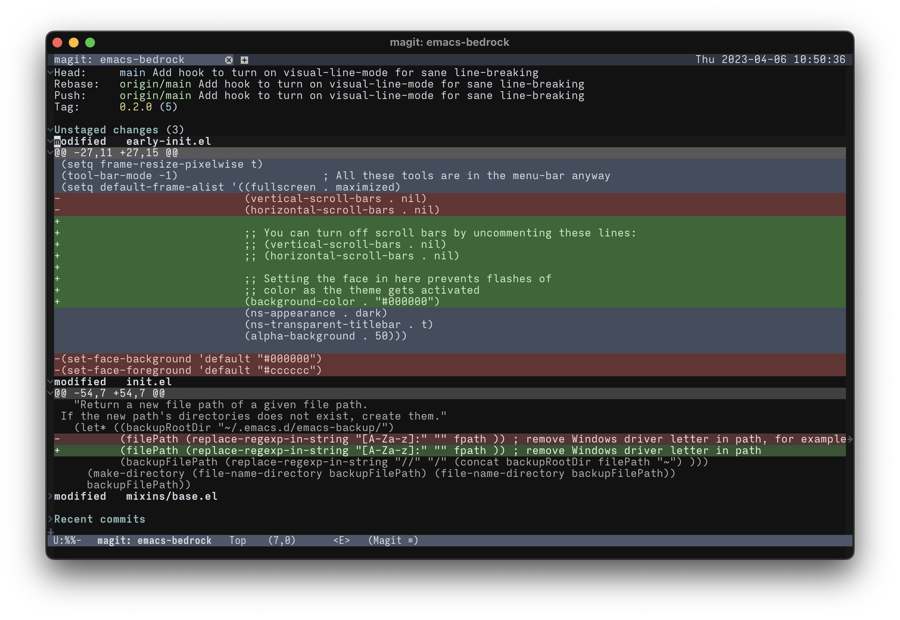
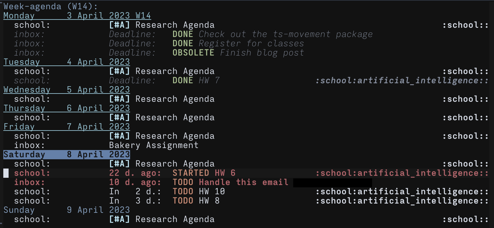

# Nordic Night Theme

<a href="https://melpa.org/#/nordic-night-theme"></a>

A darker, higher-contrast spin on the lovely [Nord color palette](https://nordtheme.com) and its corresponding [theme for Emacs](https://github.com/nordtheme/emacs).

There's a place holder repo [on GitHub](https://github.com/ashton314/nordic-night) if you like starring things.

# Description

I really like the [Nord](https://nordtheme.com) color palette—I think the colors gel together really well. However, I never liked how low-contrast the background and body text were.

This is my personal twist on the Nord theme for Emacs: this has a darker background and uses a wider range of the color pallet in general code. Generally this makes Emacs a little more colorful and higher-contrast with the background without being too in-your-face about it. It's supposed to feel gentle and easy to read. Some of the major modifications include:

 - Background is much darker at `#121212`.
 - Many of the `font-lock-*-face` variables have been customized to use colors other than shades of blue.
 - No light-theme support.

I'll add some screenshots as I go along. Please feel free to [send any suggestions](https://todo.sr.ht/~ashton314/nordic-night) you may have, though bear in mind this is a hobby project.

Nordic Night has some support for terminals with a lower range of colors.

## Nordic Midnight

New in version 2.0.0, there is now a `nordic-midnight` theme: a few of the colors are little darker—most notably the background is pure black.

<!-- # Color palette -->

<!-- <style> -->
<!-- .pill { -->
<!--   height: 5rem; -->
<!--   width: 8rem; -->
<!--   text-align: center; -->
<!--   margin-left: 0.5rem; -->
<!--   margin-right: 0.5rem; -->
<!--   border-radius: 0.5rem; -->
<!-- } -->
<!-- .pill-row { -->
<!--     display: flex; -->
<!--     justify-content: around; -->
<!--     margin-bottom: 0.5rem; -->
<!-- } -->
<!-- </style> -->

<!-- <div class="pill-row"> -->
<!--   <div class="pill" style="background-color: #121212"> -->
<!--     nearblack -->
<!--   </div> -->
<!--   <div class="pill" style="background-color: #181818"> -->
<!--     lighterblack -->
<!--   </div> -->
<!--   <div class="pill" style="background-color: #3b4252"> -->
<!--     nord1 -->
<!--   </div> -->
<!--   <div class="pill" style="background-color: #434c5e"> -->
<!--     nord2 -->
<!--   </div> -->
<!--   <div class="pill" style="background-color: #4C566A"> -->
<!--     nord3 -->
<!--   </div> -->
<!-- </div> -->
<!-- <div class="pill-row"> -->
<!--   <div class="pill" style="background-color: #6b7e86"> -->
<!--     lessdark3.1 -->
<!--   </div> -->
<!--   <div class="pill" style="background-color: #8892a4"> -->
<!--     lessdark3.2 -->
<!--   </div> -->
<!--   <div class="pill" style="background-color: #b5bdcc"> -->
<!--     lessdark3.3 -->
<!--   </div> -->
<!-- </div> -->
<!-- <div class="pill-row"> -->
<!--   <div class="pill" style="background-color: #D8DEE9; color: #3b4252"> -->
<!--     nord4 -->
<!--   </div> -->
<!--   <div class="pill" style="background-color: #E5E9F0; color: #3b4252"> -->
<!--     nord5 -->
<!--   </div> -->
<!--   <div class="pill" style="background-color: #ECEFF4; color: #3b4252"> -->
<!--     nord6 -->
<!--   </div> -->
<!-- </div> -->
<!-- <div class="pill-row"> -->
<!--   <div class="pill" style="background-color: #8FBCBB"> -->
<!--     nord7 -->
<!--   </div> -->
<!--   <div class="pill" style="background-color: #88C0D0"> -->
<!--     nord8 -->
<!--   </div> -->
<!--   <div class="pill" style="background-color: #81A1C1"> -->
<!--     nord9 -->
<!--   </div> -->
<!--   <div class="pill" style="background-color: #5E81AC"> -->
<!--     nord10 -->
<!--   </div> -->
<!-- </div> -->
<!-- <div class="pill-row"> -->
<!--   <div class="pill" style="background-color: #BF616A"> -->
<!--     nord11 -->
<!--   </div> -->
<!--   <div class="pill" style="background-color: #D08770"> -->
<!--     nord12 -->
<!--   </div> -->
<!--   <div class="pill" style="background-color: #EBCB8B"> -->
<!--     nord13 -->
<!--   </div> -->
<!--   <div class="pill" style="background-color: #A3BE8C"> -->
<!--     nord14 -->
<!--   </div> -->
<!--   <div class="pill" style="background-color: #B48EAD"> -->
<!--     nord15 -->
<!--   </div> -->
<!-- </div> -->

# Installing

Nordic Night is now on [Melpa](https://melpa.org/#/nordic-night-theme), so provided you've [added MELPA](https://melpa.org/#/getting-started) to your `package-archives` variable, you should be able to run `package-update` and `package-install` to get it.

If you're using the excellent `use-package` macro (built-in with the upcoming Emacs 29 release!) then you can install it like so:

```emacs-lisp
(use-package nordic-night-theme
  :ensure t
  :config
  (load-theme 'nordic-night t))
```

Alternatively, you can just clone this repository and add the following to your `init.el`:

```emacs-lisp
(load-file "path/to/nordic-night/nordic-night-theme.el")
(load-theme 'nordic-night t)
```

## Installing from source with Straight and Elpaca

If you use [straight.el](https://github.com/radian-software/straight.el) and [use-package](https://github.com/jwiegley/use-package), you can activate Nordic Night like so in your config:

```emacs-lisp
(use-package nordic-night-theme
    :straight (:type git :repo "https://git.sr.ht/~ashton314/nordic-night" :branch "main")
    :init (load-theme 'nordic-night t))
```

The `:straight` keyword and explicit recipe are now unnecessary if you're using MELPA, but this still works if you want to pull the source directly.

If you use [Elpaca](https://github.com/progfolio/elpaca), you can install Nordic Night like so:

```emacs-lisp
(use-package nordic-night-theme
  :elpaca (nordic-night :host sourcehut :repo "ashton314/nordic-night")
  :config
  (load-theme 'nordic-night t))
```

The same goes for the `:elpaca` keyword as it does for the `:straight` keyword from above—you shouldn't really need it if you use MELPA.

# Screenshots

All screenshots were taken on a computer running macOS using my [Iosevka Output Extended](https://sr.ht/~ashton314/iosevka-output/) font.

Editing some Emacs Lisp. (Code from [Emacs Bedrock](https://sr.ht/~ashton314/emacs-bedrock/))



Markdown file.



Using [Avy](https://github.com/abo-abo/avy).



Detail: dired.



Detail: active and inactive mode-lines.



Detail: tab-bar (active tab on left, inactive on right).



Detail: using the excellent [Vertico](https://github.com/minad/vertico) completing-read interface with [Marginalia](https://github.com/minad/marginalia/).



Detail: completion-at-point popup with [Corfu](https://github.com/minad/corfu).

.

Detail: [Magit](https://magit.vc) status buffer.



Detail: Org-agenda.



# Bugs and Contact

Submit bugs to the [issue tracker on SourceHut](https://todo.sr.ht/~ashton314/nordic-night).

I may occasionally write to [my general mailing list](https://lists.sr.ht/~ashton314/public-inbox).

# License

MIT. I modified the Nord theme to make this, which too was licensed under the MIT. Knock your socks off.

# Authors

 - Ashton Wiersdorf https://lambdaland.org
