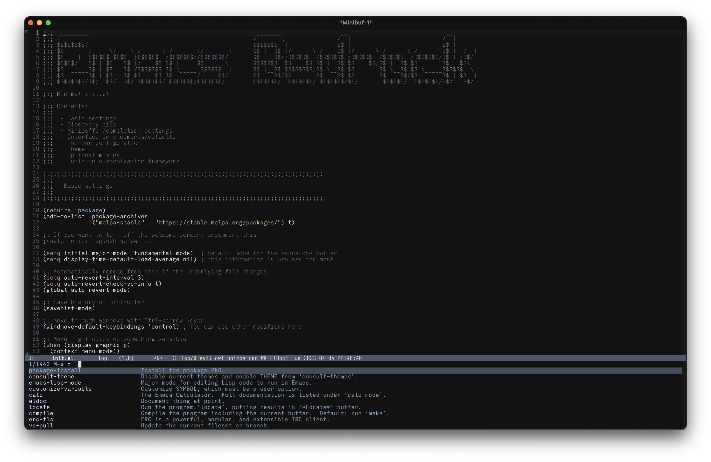
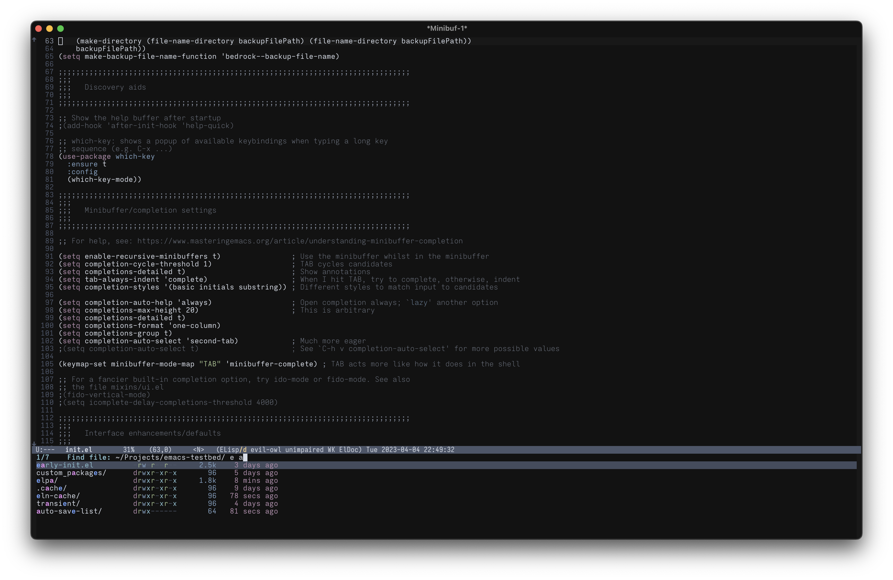
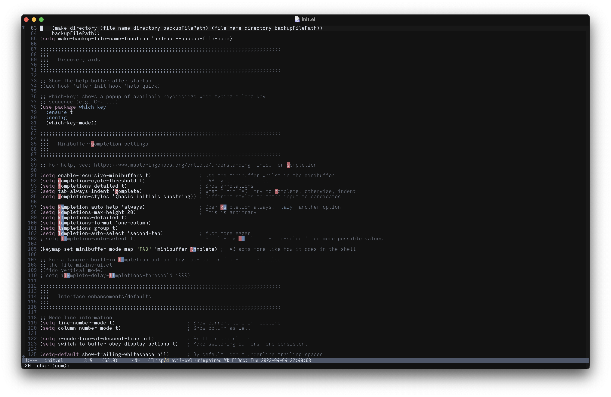
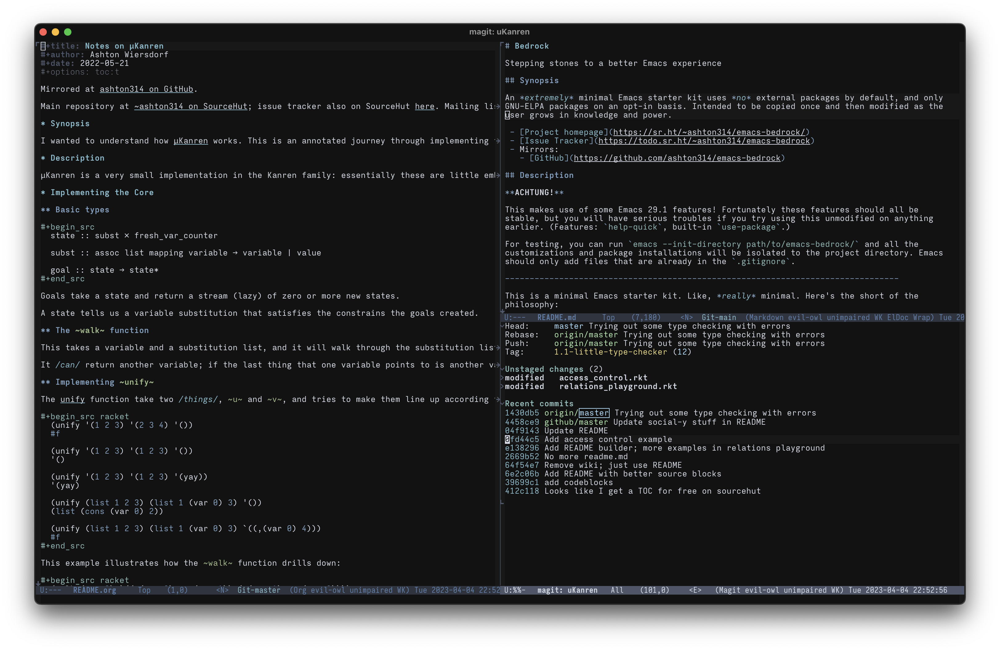

# Nordic Night Theme

A darker, higher-contrast spin on the lovely [Nord](https://nordtheme.com) [theme for Emacs](https://github.com/nordtheme/emacs).

# Description

This is my personal twist on the Nord theme for Emacs: this has a darker background and uses a wider range of the color pallet in general code.

# Screenshots

Editing some Emacs Lisp. (Code from [Emacs Bedrock](https://sr.ht/~ashton314/emacs-bedrock/))

Using the excellent [Vertico](https://github.com/minad/vertico) completing-read interface with [Marginalia](https://github.com/minad/marginalia/) and [Orderless](https://sr.ht/~ashton314/emacs-bedrock/) enabled.

`find-file` with Vertico activated.

Using [Avy](https://github.com/abo-abo/avy).

Org-mode, Markdown-mode, and [Magit](https://magit.vc) open. (Org mode file is [here](https://git.sr.ht/~ashton314/microKanren).)

# Bugs and Contact

Submit bugs to the [issue tracker on SourceHut](https://todo.sr.ht/~ashton314/nordic-night).

I may occasionally write to [my general mailing list](https://lists.sr.ht/~ashton314/public-inbox).

# Authors

 - Ashton Wiersdorf https://lambdaland.org
