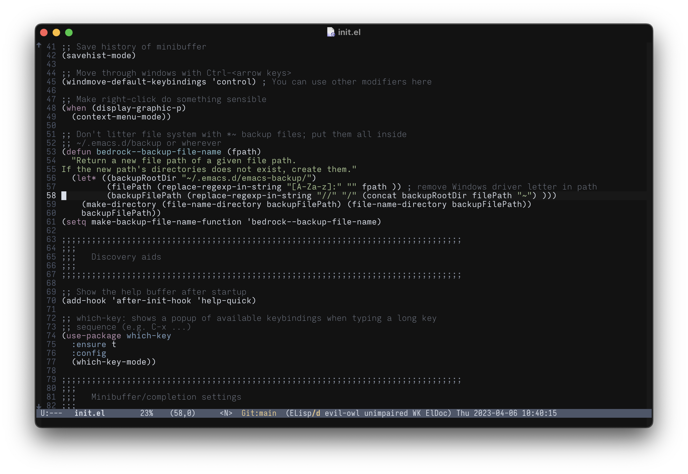

# Nordic Night Theme

A darker, higher-contrast spin on the lovely [Nord](https://nordtheme.com) [theme for Emacs](https://github.com/nordtheme/emacs).

# Description

This is my personal twist on the Nord theme for Emacs: this has a darker background and uses a wider range of the color pallet in general code.

# Screenshots

Editing some Emacs Lisp. (Code from [Emacs Bedrock](https://sr.ht/~ashton314/emacs-bedrock/))

# Bugs and Contact

Submit bugs to the [issue tracker on SourceHut](https://todo.sr.ht/~ashton314/nordic-night).

I may occasionally write to [my general mailing list](https://lists.sr.ht/~ashton314/public-inbox).

# Authors

 - Ashton Wiersdorf https://lambdaland.org
